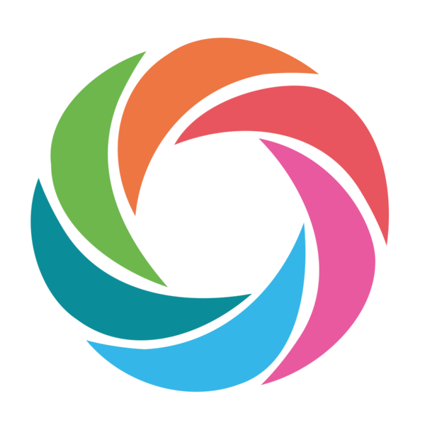

**<h2 align="center">Hi,  I'm Mahesh</h2>**
<h3 align="center">A passionate developer from India</h3>

  

- 🌱 I’m currently learning **TensorFlow,ScikitLearn**

- 👯 I’m looking to collaborate on **Python projects**

- 💬 Ask me about **Python**

- ⚡ Fun fact **funny**

**<h3 align="center">----- Connect with me -----</h3>**

**<h3 align="center">----- Languages -----</h3>**

 

 
 
 
    
    
 
    

  
  
**<h3 align="center">----- Frameworks & Tools -----</h3>**

 
 
 
 
 
 
 
 
 
 
 
 
 
 

**<h3 align="center">Github Stat's</h3>**

